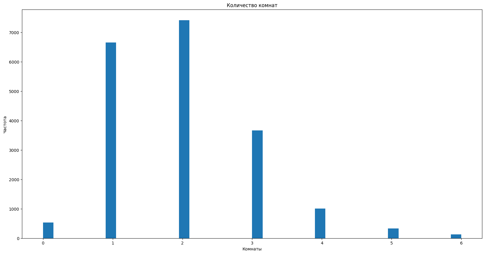

## Как смотреть релиз 3
- Итоговые данные в файле "Release3/data.csv" - используй их для модели
- Файл "Release3/data2.csv" - это файл по итогам Release2, где мы чистили данные
- Файл preprocessing.ipynb - там описана логика работы, но не вся. Большинство логики останется фольклором и будет передаваться из уст в уста в нашей команде :)

### Состав  Команды: 'ubuntu':
1. ['Владимир']
2. ['Владислав']https://github.com/Vlad1slawoo
3. ['Дмитрий']https://github.com/cobalt1705
4. ['Мирас'] 

### Цель проекта
- создать модель машинного обучения, которая будет оценивать квартиры и предлагать стоимость аренды максимально похожую на ту, которую выставляют люди 
- технически задача предполагает улучшить метрику качества модели **MAPE** с 50% до 30% и менее, т.к. эта метрика показывает *среднюю абсолютную ошибку в процентах* - очень понятную для менеджеров
- Подготовка данных для машинного обучения

В качестве пилотного региона выбрана **Москва** 

### Пара графиков, чтобы показать, что мы можем :)

### Мы доделаем этот документ, если наша модель окажется хотя немного боеспособной :)
